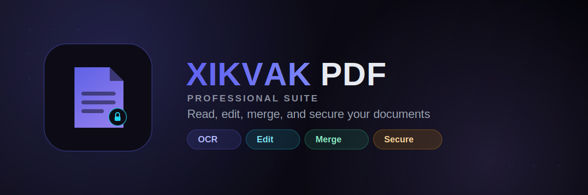

[-blue)](#)

**Read, edit, merge, and secure your PDF documents — all in one place.**

[Download APK](../../releases/latest) · [Features](#-features) · [Screenshots](#-screenshots) · [Install](#-installation) · [Support](#-support-the-project)

---

## 📱 About

**XIKVAK PDF** is a professional PDF suite for Android — open and read large documents comfortably, mark them up, and manage a whole library of files, with OCR, merging, and password protection built in.

This repository distributes the **compiled APK only** — no source code, no build files.

## ✨ Features

**Reader**
- Smooth page-by-page viewing with a live page counter, built for documents of any length
- Adjustable zoom (precise percentage control)
- Highlight, underline, strikethrough, sticky notes, and freehand pencil annotations
- Text size and color/theme controls for comfortable reading
- Undo/redo for every edit
- Crop/select tool for pulling regions out of a page

**Document tools**
- **OCR** — extract text from scanned pages or image-based PDFs
- **Edit** — modify PDF content directly
- **Merge** — combine multiple PDFs into one
- **Secure** — password-protect and lock sensitive documents

**Organization**
- **Library** — all your documents in one place
- **History** — quickly get back to recently opened files
- **Device Files** — browse and open PDFs straight from your phone's storage

## 📸 Screenshots

<!-- Screenshots go here. Drop your PNGs into docs/screenshots/ and reference them, e.g.: -->
<!--
  
-->

## 📥 Installation

1. Go to the **[Releases](../../releases)** page and download the latest `.apk`.
2. On your phone, go to **Settings → Apps → Special access → Install unknown apps**, and allow your browser or file manager to install APKs. (Exact wording varies by Android version/vendor.)
3. Open the downloaded file and tap **Install**.
4. Requires **Android 7.0 (Nougat, API 24) or newer**.

## 🔐 Permissions

| Permission | Why it's requested |
|---|---|
| Storage / files access | Needed to open PDFs from your device and save edited or merged files back to it. |
| Camera *(if document scanning is included)* | Needed only if you use a "scan to PDF" style feature; not required for OCR on files you already have. |

## 💬 Support the project

XIKVAK PDF is free. If it's useful to you, a donation of any size keeps development alive:

- **Card (Visa):** `4916 9903 1117 9219`
- **Card holder:** XLKVAK
- **Telegram:** [@XlKVAK](https://t.me/XlKVAK)
- **Email:** [xikvak3@gmail.com](mailto:xikvak3@gmail.com)

And if a donation isn't possible — a sincere prayer for the developer is more than enough. Thank you!

Found a bug, or have a feature idea? Reach out through Telegram or email above, or open an [issue](../../issues).

## ⚠️ Disclaimer

XIKVAK PDF is an independent project and is not affiliated with, endorsed by, or sponsored by Adobe, Google, or any other document software vendor.

## 📄 License

*Add your chosen license here (e.g. MIT, Apache 2.0, or "All rights reserved") before publishing.*

---

Made with care

